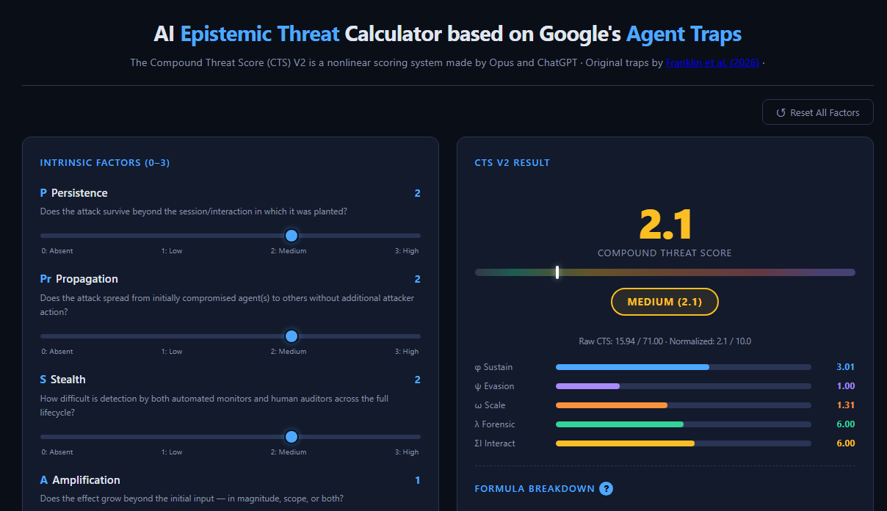

# AI Epistemic Threat Calculator

# CTS v2 — Compound Threat Score Calculator  
  
**A nonlinear scoring system for evaluating compound AI agent attack chains.**  
  
Inspired by [CVSS](https://www.first.org/cvss/) but purpose-built for the unique threat dynamics of agentic AI systems, CTS v2 captures the multiplicative danger that emerges when attack mechanisms combine, because an attack that is persistent *and* stealthy *and* autonomous is qualitatively more dangerous than the sum of those properties suggests.  
  
> Based on the Agent Trap taxonomy from [Franklin et al. (2026)](https://papers.ssrn.com/sol3/papers.cfm?abstract_id=6372438) and the Compound Threat Framework developed through independent analysis by Claude Opus 4.6 and ChatGPT 5.2.  
  
  
  
---  
  
## Table of Contents  
  
- [Part 1 — Motivation](#part-1--motivation)  
- [Part 2 — How-To Guide](#part-2--how-to-guide)  
- [Part 3 — Technical Specification](#part-3--technical-specification)  
- [Quick Start](#quick-start)  
- [License](#license)  
  
---  
  
## Part 1 — Motivation  
  
### The Problem with Additive Risk Scoring  
  
Traditional vulnerability scoring systems — including most AI safety evaluation frameworks — treat risk factors as independent and additive. A persistent attack scores some points for persistence. A stealthy attack scores some points for stealth. The total is the sum.  
  
This fundamentally misrepresents how compound threats work in agentic AI systems.  
  
Consider two attacks:  
  
| Attack | Persistence | Stealth | Propagation | Autonomy | Additive Score |  
|--------|:-----------:|:-------:|:-----------:|:--------:|:--------------:|  
| A      | 3           | 0       | 0           | 0        | 3              |  
| B      | 2           | 2       | 2           | 2        | 8              |  
  
Under additive scoring, Attack B is roughly 2.7× worse than Attack A. In reality, Attack B is **qualitatively different** — it's an autonomous, stealthy, self-propagating persistent infection. Attack A is a loud, isolated, manually-operated nuisance that happens to stick around. The actual danger ratio is closer to 10× or 100×, not 2.7×.  
  
### Why Agentic AI Needs Its Own Scoring System  
  
CVSS was designed for software vulnerabilities in traditional IT infrastructure. Agentic AI introduces threat dynamics that have no analogue in conventional cybersecurity:  
  
- **Epistemic attacks** — corrupting what an agent *believes* rather than what it *does*, with no malicious code to detect  
- **Memory persistence** — poisoned knowledge that survives across sessions and compounds over time  
- **Multi-agent propagation** — false beliefs spreading through shared retrieval corpora, creating self-reinforcing false consensus  
- **Human oversight defeat** — attacks that don't just evade automated detection but exploit human cognitive biases, making the overseer *endorse* the attack  
- **Remediation resistance** — self-reinforcing contamination where cleaning one node doesn't prevent reinfection from others  
  
These properties interact multiplicatively. CTS v2 was designed from the ground up to capture these nonlinear dynamics.  
  
### The Research Behind CTS  
  
The scoring system emerged from a systematic analysis of all 20 unique three-way combinations of the six Agent Trap categories identified by Franklin et al. (2025):  
  
| Abbreviation | Trap Category | What It Targets |  
|:------------:|---------------|-----------------|  
| CI | Content Injection | What the agent *perceives* |  
| SM | Semantic Manipulation | How the agent *reasons* |  
| CS | Cognitive State | What the agent *remembers and believes* |  
| BC | Behavioural Control | What the agent *does* |  
| SY | Systemic | How agents *interact at scale* |  
| HL | Human-in-the-Loop | How humans *oversee and verify* |  
  
Two frontier AI systems (Claude Opus 4.6 and ChatGPT 5.2) independently analyzed all 20 triples, scoring them on 7 (later 8) threat factors. Their results showed Jaccard similarity of 0.67 in the top-5, with both converging on the same structural conclusion:  
  
> **Any triple containing Cognitive State (CS) + Systemic (SY) dominates the risk landscape.** Persistent memory corruption combined with ecosystem-wide propagation creates self-sustaining, self-reinforcing epistemic threats that defeat all existing layers of oversight.  
  
The additive scoring system used in the initial analysis (range 11–21) failed to capture the qualitative gap between these existential-tier threats and routine single-session attacks. CTS v2 was developed to fix this, producing a 0–10 normalized score with meaningful separation across threat tiers.  
  
### Key Findings  
  
The two highest-scoring triples under CTS v2 both achieve **10.0 (Existential)**:  
  
| Triple | CTS | Mechanism |  
|--------|:---:|-----------|  
| SM + CS + SY | 10.0 | **Manufactured epistemic reality** — biased language corrupts reasoning, gets stored as knowledge, propagates across agents, creates self-reinforcing false consensus indistinguishable from genuine agreement |  
| CS + SY + HL | 10.0 | **Total epistemic capture** — every verification path the human overseer can take returns the same corrupted answer |  
  
The lowest-scoring triples score below **1.5 (Low)**:  
  
| Triple | CTS | Mechanism |  
|--------|:---:|-----------|  
| CI + SM + BC | 1.1 | Layered evasion for single-session jailbreak |  
| SM + BC + HL | 1.2 | Human-approved malicious action (ephemeral) |  
  
The **9.4× ratio** between top and bottom (vs. 1.9× under additive scoring) correctly reflects the qualitative reality that an autonomous epistemic epidemic is not merely "twice as bad" as a session-bound jailbreak — it's an entirely different category of threat.  
  
---  
  
## Part 2 — How-To Guide  
  
### Quick Start  
  
1. Download `index.html` (the single file — no dependencies, no build step)  
2. Open it in any modern browser  
3. Adjust the sliders  
4. Read the score  
  
That's it. Everything runs client-side. No data leaves your browser.  
  
### Interface Overview  
  
The calculator has two panels:  
  
| Panel | Contents |  
|-------|----------|  
| **Left — Input** | 8 intrinsic factor sliders + 2 context factor sliders + reset button |  
| **Right — Results** | Score, tier badge, component bars, formula breakdown, interaction bonuses, CxTS, severity reference, vector string |  
  
A **Reset All Factors** button appears at the top of the page (always visible) and at the bottom of the input panel (convenient when scrolling).  
  
---  
  
### Mode 1: Intrinsic CTS (Core Assessment)  
  
This is the primary scoring mode. It evaluates the **mechanism-level danger** of a compound attack chain, independent of deployment context.  
  
#### Step 1 — Score the 8 Factors  
  
For each factor, move the slider from 0 (absent) to 3 (high). The score updates in real time.  
  
| Factor | Symbol | Question to Ask |  
|--------|:------:|-----------------|  
| **Persistence** | P | Does the attack survive beyond the current session? |  
| **Propagation** | Pr | Does it spread to other agents without attacker action? |  
| **Stealth** | S | How hard is it to detect across the full lifecycle? |  
| **Amplification** | A | Does the effect grow beyond the initial input? |  
| **Oversight Defeat** | O | Does it beat automated filters, critic models, *and* human review? |  
| **Autonomy** | Au | Does it run, maintain, and escalate itself? |  
| **Temporal Separation** | T | Is there a delay between planting and effect? |  
| **Remediation Resistance** | R | Once found, how hard is full cleanup? |  
  
**Scoring guidance for each level:**  
  
| Level | General Meaning |  
|:-----:|-----------------|  
| 0 | Absent — this property does not apply |  
| 1 | Low — present but weak or easily countered |  
| 2 | Medium — meaningfully present, requires dedicated effort to counter |  
| 3 | High — fully present, represents the worst case for this property |  
  
#### Step 2 — Read the Results  
  
**The CTS Score (0–10)** appears as the large number at the top of the results panel, color-coded by severity tier.  
  
**The Severity Tier** is displayed as a badge below the score:  
  
| Score | Tier | Color | Meaning |  
|:-----:|------|:-----:|---------|  
| 0.0 | None | Grey | All factors at zero — no threat assessed |  
| 0.1 – 1.9 | Low | Green | Transient, local, detectable — standard security practices suffice |  
| 2.0 – 3.9 | Medium | Yellow | Meaningful threat requiring dedicated defenses |  
| 4.0 – 6.9 | High | Orange | Persistent, evasive, or scalable — requires defense-in-depth |  
| 7.0 – 8.9 | Critical | Red | Multiple multiplicative cores active — systemic risk |  
| 9.0 – 10.0 | Existential | Purple | Self-sustaining, undetectable, ecosystem-scale epistemic capture |  
  
> **Note:** The first five bands (None through Critical) align exactly with CVSS v3.1/v4.0 severity ratings. The sixth — **Existential** — is a CTS-specific extension for threats that achieve total epistemic capture, a failure mode unique to agentic AI that has no CVSS equivalent.  
  
**The Component Bars** show the five formula components visually:  
  
| Bar | What It Shows |  
|-----|---------------|  
| φ Sustain | Sustainability Core — is the attack self-perpetuating? |  
| ψ Evasion | Evasion Core — is it invisible to all defenses? |  
| ω Scale | Scale Core — how big is the blast radius? |  
| λ Forensic | Forensic Penalty — how hard is attribution and cleanup? |  
| ΣI Interact | Interaction Bonuses — which synergistic pairs are active? |  
  
**The Formula Breakdown** shows every intermediate calculation with the actual numbers, so you can audit exactly how the score was derived.  
  
**The Interaction Bonuses** section shows each of the 5 pairwise synergies as either active (highlighted blue with the bonus value) or inactive (greyed out with "—"). A bonus activates when **both** factors in the pair are ≥ 2.  
  
#### Step 3 — Export  
  
**The Vector String** at the bottom encodes the complete assessment in a single copyable line:  

'''
CTS:2/P:3/Pr:3/S:3/A:3/O:3/Au:3/T:3/R:3/Rev:0/D:0/Score:10.0/CxTS:10.0/Existential
'''

  
Click it to copy to clipboard. This string contains:  
- Protocol version (`CTS:2`)  
- All 8 intrinsic factor values  
- Both context factor values (0 if not used)  
- Normalized CTS score  
- CxTS score  
- Tier name  
  
Use this for:  
- Embedding in security reports  
- Comparing assessments across teams  
- Tracking score changes over time  
- Feeding into risk registers or dashboards  
  
#### The "?" Formula Reference  
  
Click the blue **?** button next to "Formula Breakdown" to open a full-screen modal explaining every component of the formula in plain language. This includes:  
- What each core measures and why its factors multiply  
- The interaction bonus table with thresholds  
- The normalization method  
- The CxTS harm multiplier  
- The complete severity band definitions  
  
Press **Escape**, click **✕**, or click outside the modal to close it.  
  
---  
  
### Mode 2: Contextual CTS (CxTS) — With Reversibility of Harm  
  
The CxTS extends the intrinsic score by accounting for **deployment context** — specifically, how reversible the real-world consequences are and how critical the domain is.  
  
#### When to Use CxTS  
  
Use CxTS when you need to compare the **actual danger** of the same attack mechanism across different deployment contexts. The intrinsic CTS tells you how dangerous the *mechanism* is; CxTS tells you how dangerous it is *here*.  
  
Example: The triple SM+CS+SY scores CTS 10.0 regardless of context. But its real-world impact differs enormously:  
  
| Context | Rev | D | H | CxTS | Interpretation |  
|---------|:---:|:-:|:---:|:----:|---------------|  
| Entertainment recommendations | 0 | 0 | 1.00× | 10.0 | Mechanism is maximally dangerous but consequences are trivially reversible in a low-stakes domain |  
| Financial advisory | 2 | 2 | 1.67× | 10.0* | Capped at 10.0 — already at maximum |  
| Medical diagnosis | 3 | 3 | 2.50× | 10.0* | Capped at 10.0 — already at maximum |  
  
*CxTS is capped at 10.0 to maintain the 0–10 scale.*  
  
The CxTS extension is most informative for **mid-tier threats** where the intrinsic score alone doesn't tell the full story:  
  
| Context | CTS | Rev | D | H | CxTS |  
|---------|:---:|:---:|:-:|:---:|:----:|  
| CI+SM+BC in entertainment | 1.1 | 0 | 0 | 1.00× | 1.1 (Low) |  
| CI+SM+BC in medical | 1.1 | 2 | 3 | 2.00× | 2.2 (Medium) |  
| SM+CS+BC in entertainment | 4.5 | 0 | 0 | 1.00× | 4.5 (High) |  
| SM+CS+BC in medical | 4.5 | 3 | 3 | 2.50× | 10.0 (Existential) |  
  
#### Step 1 — Score the Context Factors  
  
Below the 8 intrinsic factors, two additional sliders appear under **"Context Factors (CxTS)"**:  
  
| Factor | Symbol | Question to Ask | Levels |  
|--------|:------:|-----------------|--------|  
| **Reversibility** | Rev | Can the real-world damage be undone? | 0 = fully reversible → 3 = irreversible |  
| **Domain Criticality** | D | How high are the stakes? | 0 = entertainment → 3 = medical/defense/infrastructure |  
  
#### Step 2 — Read the CxTS  
  
The **Contextual Threat Score** section shows:  
- The **Harm Multiplier H** (1.00× to 2.50×)  
- The **CxTS score** (0–10, capped)  
- Its own **severity badge**  
  
#### Interpretation Rules  
  
1. **CTS and CxTS use the same 0–10 scale and the same tier thresholds.** A CxTS of 7.0 means "Critical" just as a CTS of 7.0 does.  
2. **CxTS ≥ CTS always.** The harm multiplier is ≥ 1.0, so context can only increase (or maintain) the score, never decrease it.  
3. **CxTS is capped at 10.0.** Even a 2.5× multiplier on a CTS of 8.0 yields CxTS = 10.0, not 20.0.  
4. **If you leave Rev and D at 0, CxTS = CTS.** The context extension is opt-in. If you don't set context factors, you're in pure intrinsic mode.  
5. **CxTS does not change the CTS ranking.** For any fixed (Rev, D), the ordering of attacks by CxTS is identical to their ordering by CTS. Context only matters for cross-domain comparisons.  
  
#### When to Report CTS vs. CxTS  
  
| Scenario | Report |  
|----------|--------|  
| Evaluating an attack mechanism in general | **CTS only** (leave Rev/D at 0) |  
| Evaluating a specific threat to a specific deployment | **Both CTS and CxTS** |  
| Comparing the same mechanism across domains | **CTS once, CxTS per domain** |  
| Feeding into a risk register | **CxTS** (it incorporates context) |  
| Academic/research analysis | **CTS** (context-independent, reproducible) |  
  
---  
  
### Workflow Example  
  
**Scenario:** You're assessing the risk of a Semantic Manipulation + Cognitive State + Systemic (SM+CS+SY) attack chain against a multi-agent financial advisory platform.  
  
1. **Open the calculator** in your browser  
2. **Score intrinsic factors** based on your analysis of the attack mechanism:  
   - P=3 (memory stores corruption permanently)  
   - Pr=3 (propagates via shared retrieval corpora)  
   - S=3 (no injection artifacts — just biased language)  
   - A=3 (self-reinforcing: corrupted memory biases reasoning which generates more corruption)  
   - O=3 (false consensus defeats both automated cross-referencing and human verification)  
   - Au=3 (fully self-sustaining)  
   - T=3 (gradual, organic-looking spread)  
   - R=3 (cleaning one node doesn't prevent reinfection)  
3. **Read CTS: 10.0 (Existential)** — the mechanism is maximally dangerous  
4. **Score context factors** for your specific deployment:  
   - Rev=2 (financial decisions are partially reversible — some trades can be unwound, others can't)  
   - D=2 (financial services = high stakes)  
5. **Read CxTS: 10.0 (Existential)** — already at cap due to maximal intrinsic score  
6. **Click the vector string** to copy: `CTS:2/P:3/Pr:3/S:3/A:3/O:3/Au:3/T:3/R:3/Rev:2/D:2/Score:10.0/CxTS:10.0/Existential`  
7. **Paste into your security report** alongside your narrative analysis  
  
---  
  
## Part 3 — Technical Specification  
  
### Architecture Overview  
  
CTS v2 uses a **hybrid multiplicative-additive architecture** with five components:  
  
**Design principles:**  
1. **Multiplicative cores** capture nonlinear interactions between factors that jointly determine catastrophic vs. merely problematic outcomes  
2. **Additive modifiers** capture factors that scale linearly — they worsen an attack but don't qualitatively transform it  
3. **Interaction bonuses** capture specific pairwise synergies creating emergent dangers  
4. **Normalization** maps to a 0–10 scale for CVSS compatibility  
5. **Contextual extension** separates intrinsic mechanism danger from deployment-specific harm  
  
---  
  
### Component 1: φ — Sustainability Core  
  
'''
φ(P, Pr, Au) = 1 + (P × Pr^0.7 × Au) / 19.44 × 4
'''

  
| Parameter | Value | Rationale |  
|-----------|-------|-----------|  
| Normalization denominator | 19.44 = 3 × 3^0.7 × 3 | Maximum possible numerator |  
| Scaling constant k₁ | 4 | Gives φ ∈ [1.0, 5.0] |  
| Pr exponent | 0.7 (concave) | See "Propagation Decomposition" below |  
  
**What it captures:** Whether the attack is self-sustaining and spreading. These three factors are multiplicative because:  
  
- **Persistence without Autonomy** requires the attacker to manually maintain the attack each session  
- **Autonomy without Persistence** creates a one-shot event that dies when the session ends  
- **Propagation without either** is a flash in the pan — it spreads but doesn't stick  
- **All three together** create an autonomous, persistent, spreading infection — qualitatively different from any subset  
  
**Range:** 1.0 (no sustainability) to 5.0 (fully autonomous persistent epidemic)  
  
---  
  
### Component 2: ψ — Evasion Core  

'''
ψ(S, O) = 1 + (S × O) / 9 × 3
'''

  
| Parameter | Value | Rationale |  
|-----------|-------|-----------|  
| Normalization denominator | 9 = 3 × 3 | Maximum S × O |  
| Scaling constant k₂ | 3 | Gives ψ ∈ [1.0, 4.0] |  
  
**What it captures:** Whether any layer of defense can detect the attack. Multiplicative because:  
  
- **High Stealth + weak Oversight Defeat** = automated systems catch it even though it's hard to see  
- **Strong Oversight Defeat + low Stealth** = basic scanning finds it even though it beats higher-level review  
- **Both high** = invisible to every layer in the defensive stack  
  
**Range:** 1.0 (trivially detectable) to 4.0 (invisible to all defenses)  
  
---  
  
### Component 3: ω — Scale Core  

'''
ω(A, Pr) = 1 + (A × 0.7 × Pr) / 9 × 2
'''

  
| Parameter | Value | Rationale |  
|-----------|-------|-----------|  
| Pr coefficient | 0.7 (attenuated) | See "Propagation Decomposition" below |  
| Normalization denominator | 9 = 3 × 3 | Maximum A × Pr (before attenuation) |  
| Scaling constant k₃ | 2 | Gives ω ∈ [1.0, 3.0] |  
  
**What it captures:** The blast radius — how far and how intensely the effect reaches. Multiplicative because:  
  
- **Amplification without Propagation** = local escalation (one agent gets very corrupted)  
- **Propagation without Amplification** = weak signal spreading (many agents slightly affected)  
- **Both** = exponential growth across the ecosystem  
  
**Range:** 1.0 (contained) to 3.0 (ecosystem-scale exponential growth)  
  
---  
  
### Propagation Decomposition  
  
Propagation (Pr) appears in both φ and ω because it genuinely serves two distinct causal roles:  
  
1. **In φ (Sustainability):** Propagation sustains the attack by spreading to new hosts, preventing containment. This is the epidemiological role (analogous to R₀). The critical threshold is between "can't spread at all" (Pr=0) and "can spread" (Pr=1). Above that, additional propagation speed has diminishing returns for sustainability. Hence: **Pr^0.7** (concave transformation).  
  
2. **In ω (Scale):** Propagation determines blast radius — how many agents are simultaneously affected. This scales more linearly. But to compensate for the double-counting, we use **0.7 × Pr** (attenuated).  
  
**Effect on propagation influence:**  
  
| Pr | Pr^0.7 (in φ) | 0.7×Pr (in ω) |  
|:--:|:--------------:|:--------------:|  
| 0  | 0              | 0              |  
| 1  | 1.00           | 0.70           |  
| 2  | 1.62           | 1.40           |  
| 3  | 2.16           | 2.10           |  
  
**Validation:** Under CTS v1 (no decomposition), the combined propagation multiplier (Pr=3 vs Pr=1, all else max) was 3.86×. Under v2, it's 2.86× — a 26% reduction. Propagation remains the most influential single factor (correct) but is no longer doubly influential (the v1 distortion).  
  
---  
  
### Component 4: λ — Forensic Penalty  

'''
λ(T, R) = 2 × (T + R)
'''

  
| Parameter | Value | Rationale |  
|-----------|-------|-----------|  
| Scaling constant k₄ | 2 | Gives λ ∈ [0, 12] |  
  
**What it captures:** The tail cost — how much damage persists after detection. Additive (not multiplicative) because temporal separation and remediation resistance make a bad attack worse but don't qualitatively transform it.  
  
- **T (Temporal Separation):** Delay between planting and effect complicates forensic attribution. By the time the effect manifests, the original injection point may be gone from logs.  
- **R (Remediation Resistance):** Self-reinforcing contamination, distributed state, ecosystem-wide pollution. Cleaning one node doesn't prevent reinfection from others.  
  
**Range:** 0 (immediate, trivially fixable) to 12 (months-delayed, reinfection-resistant)  
  
---  
  
### Component 5: ΣI — Interaction Bonuses  
  
Discrete bonuses awarded when specific factor pairs **both reach ≥ 2**, capturing emergent dangers that neither factor produces alone:  
  
| Pair | Bonus | Threshold | Emergent Danger |  
|------|:-----:|:---------:|-----------------|  
| P × S | +2 | both ≥ 2 | A persistent attack that's also stealthy may never be discovered at all |  
| Au × T | +2 | both ≥ 2 | A self-executing time bomb — the attacker can be long gone before it triggers |  
| O × R | +3 | both ≥ 2 | If you can't detect it AND can't fix it once found, the attack is effectively permanent |  
| Pr × A | +2 | both ≥ 2 | Spreading + amplifying crosses the epidemic threshold — growth becomes self-sustaining |  
| S × T | +2 | both ≥ 2 | Invisible AND temporally displaced from its effects — forensic attribution is near-impossible |  
  
**Maximum total bonus:** 2 + 2 + 3 + 2 + 2 = **11**  
  
**Why O × R gets +3 (not +2):** This is the most dangerous pairwise synergy. An attack that defeats oversight AND resists remediation is effectively permanent — detection doesn't lead to resolution. This qualitative step-change justifies the higher bonus.  
  
**Why threshold ≥ 2 (not ≥ 1):** At level 1, these properties are present but weak. The emergent synergy only manifests when both factors are meaningfully strong. The binary threshold is a deliberate simplification — a smoother function would be more realistic but harder to interpret and audit.  
  
---  
  
### Normalization  

'''
CTS_normalized = (CTS_raw - 1.0) / (71.0 - 1.0) × 10.0
'''

  
| Parameter | Value | Derivation |  
|-----------|-------|------------|  
| Raw minimum | 1.0 | All factors = 0: φ=1, ψ=1, ω=1, product=1, λ=0, ΣI=0 |  
| Raw maximum | 71.0 | All factors = 3: φ=5.0, ψ=4.0, ω=2.4, product=48.0, λ=12, ΣI=11 |  
  
**Special case:** When all 8 intrinsic factors are exactly 0, the normalized score is forced to **0.0** rather than the mathematical floor. This is a UX decision — the raw formula produces 1.0 (the multiplicative identity), but displaying "0.0 / None" correctly communicates "no threat assessed."  
  
The linear mapping preserves the relative ordering and ratios of all raw scores while projecting them onto the familiar 0–10 scale.  
  
---  
  
### Severity Bands  
  
| CTS Range | Severity | CVSS Equivalent | CTS-Specific Meaning |  
|:---------:|----------|:---------------:|----------------------|  
| 0.0 | None | None | No threat factors present |  
| 0.1 – 1.9 | Low | Low | Transient, local, detectable — standard security practices suffice |  
| 2.0 – 3.9 | Medium | Medium | Meaningful threat requiring dedicated defenses |  
| 4.0 – 6.9 | High | High | Persistent, evasive, or scalable — requires layered defense-in-depth |  
| 7.0 – 8.9 | Critical | Critical | Multiple multiplicative cores active — systemic risk requiring ecosystem-level response |  
| 9.0 – 10.0 | **Existential** | *(no equivalent)* | Self-sustaining, undetectable, ecosystem-scale, remediation-resistant — epistemic capture territory |  
  
The first five bands align exactly with CVSS v3.1 and v4.0. The sixth — **Existential** — is a CTS-specific extension for the class of threats that achieve total epistemic closure: a state where every verification path available to both machines and humans returns the attacker's preferred reality.  
  
---  
  
### CxTS — Contextual Threat Score  

'''
H(Rev, D) = 1 + (Rev × D) / 9 × 1.5
CxTS = min(10.0, CTS_normalized × H)
'''

  
| Parameter | Value | Rationale |  
|-----------|-------|-----------|  
| k_H | 1.5 | Gives H ∈ [1.0, 2.5] |  
| Cap | 10.0 | Maintains the 0–10 scale |  
  
**Design rationale:**  
  
CxTS exists because **reversibility of harm** is not a property of the attack mechanism — it's a property of the deployment domain. The same triple (e.g., SM+CS+BC) might be highly reversible in a content recommendation context and completely irreversible in a medical context. This is fundamentally different from the 8 intrinsic factors, which are properties of the attack chain itself.  
  
By separating context into a post-hoc multiplier:  
  
1. **The intrinsic CTS is preserved.** Two analysts can agree on CTS while disagreeing on CxTS because they're assessing different deployments.  
2. **The multiplier is multiplicative, not additive.** An irreversible attack in a critical domain doesn't just add points — it scales the entire threat.  
3. **Rankings within a domain are preserved.** For any fixed (Rev, D), the CTS ordering is unchanged.  
4. **The extension is opt-in.** Leave Rev and D at 0 and CxTS = CTS.  
  
**Context factors:**  
  
| Factor | Symbol | Scale |  
|--------|:------:|-------|  
| Reversibility | Rev | 0 = fully reversible (undo exists) → 3 = irreversible (consequences cannot be recalled) |  
| Domain Criticality | D | 0 = low stakes (entertainment) → 3 = critical (medical, infrastructure, defense) |  
  
---  
  
### Configuration Constants  
  
CTS v2 uses **Config C**, selected through sensitivity analysis across five parameter configurations:  
  
| Constant | Value | Controls | Range of Component |  
|----------|:-----:|----------|:------------------:|  
| k₁ | 4 | Sustainability Core weight | φ ∈ [1, 5] |  
| k₂ | 3 | Evasion Core weight | ψ ∈ [1, 4] |  
| k₃ | 2 | Scale Core weight | ω ∈ [1, 3] |  
| k₄ | 2 | Forensic Penalty weight | λ ∈ [0, 12] |  
| k_H | 1.5 | Harm Multiplier weight | H ∈ [1, 2.5] |  
  
**Why Config C:**  
  
A sweep across k₁ ∈ {2,3,4,5,6} with proportional k₂, k₃, k₄ showed:  
  
| Property | Result |  
|----------|--------|  
| **Rank stability** | Top-4 and bottom-3 triples invariant across all 5 configs |  
| **Tier stability** | 19/20 triples maintain their tier across all configs |  
| **Ratio stability** | Black-to-mid-tier ratio ≈ 2.5× across all configs |  
| **Separation** | Config C gives 8× ratio between max and min (vs. 6.5× for Config A, 10.3× for Config E) |  
| **Balance** | Interaction bonuses = 15% of max CTS (meaningful but not dominant) |  
  
Config C provides sufficient nonlinear amplification to capture phase transitions while keeping the scale interpretable and the additive components non-negligible.  
  
---  
  
### Theoretical Score Distribution  
  
For reference, here are the CTS v2 scores for all 20 triples from the original analysis:  
  
| Rank | Triple | Raw CTS | Normalized | Tier |  
|:----:|--------|:-------:|:----------:|------|  
| 1 | SM + CS + SY | 71.0 | 10.0 | Existential |  
| 1 | CS + SY + HL | 71.0 | 10.0 | Existential |  
| 3 | CS + BC + SY | 59.0 | 8.3 | Critical |  
| 4 | CI + CS + SY | 57.0 | 8.0 | Critical |  
| 5 | CI + CS + HL | 33.9 | 4.7 | High |  
| 5 | SM + CS + BC | 33.9 | 4.7 | High |  
| 5 | SM + CS + HL | 33.9 | 4.7 | High |  
| 5 | CS + BC + HL | 33.9 | 4.7 | High |  
| 9 | CI + SM + CS | 30.2 | 4.2 | High |  
| 10 | SM + SY + HL | 24.1 | 3.3 | Medium |  
| 11 | CI + CS + BC | 25.2 | 3.5 | Medium |  
| 12 | CI + SY + HL | 19.6 | 2.7 | Medium |  
| 13 | CI + SM + SY | 16.6 | 2.2 | Medium |  
| 13 | CI + BC + SY | 16.6 | 2.2 | Medium |  
| 13 | SM + BC + SY | 16.6 | 2.2 | Medium |  
| 16 | BC + SY + HL | 15.1 | 2.0 | Medium |  
| 17 | CI + SM + HL | 10.3 | 1.3 | Low |  
| 18 | CI + BC + HL | 9.5 | 1.2 | Low |  
| 18 | SM + BC + HL | 9.5 | 1.2 | Low |  
| 20 | CI + SM + BC | 8.9 | 1.1 | Low |  
  
**Key structural observations:**  
  
- Every **Existential** triple contains both CS and SY  
- Every **Critical** triple contains both CS and SY  
- Every triple scoring **High or above** contains CS  
- No triple lacking CS exceeds Medium  
- The four-way combination SM+CS+SY+HL represents the theoretical "total epistemic capture" scenario  
  
---  
  
### Limitations  
  
| Limitation | Impact | Mitigation |  
|------------|--------|------------|  
| **Raw scores require expert judgment** | Different analysts may assign different factor scores | CTS amplifies differences through multiplication — this surfaces disagreements (feature) but also amplifies noise (risk). Publish vector strings for reproducibility. |  
| **Interaction bonus thresholds are binary** | Smooth transitions would be more realistic | Binary thresholds are interpretable and auditable. Sensitivity analysis shows no ranking changes at threshold boundaries. |  
| **Propagation double-counting** | Pr influences both φ and ω | Mitigated by concave (Pr^0.7) and attenuated (0.7×Pr) transformations. Residual double-counting is intentional — propagation's outsized importance is empirically validated. |  
| **No attacker cost model** | A cheap attack scoring 4.0 may be more likely than an expensive one scoring 8.0 | CTS measures mechanism danger, not likelihood. A cost-adjusted variant (CTS / attacker_cost) would be valuable future work. |  
| **Not empirically calibrated** | Config C constants are theoretically motivated, not fit to data | Sensitivity analysis shows rank invariance across a 3× parameter range. Empirical calibration against red-teaming results is the priority for v3. |  
  
---  
  
## Quick Start  
  
```bash  
# Clone the repository  
git clone https://github.com/YOUR_USERNAME/cts-v2-calculator.git  
  
# Open in browser (no build step, no dependencies)  
open index.html  
# or  
xdg-open index.html  
# or just double-click the file

Requirements: Any modern browser (Chrome, Firefox, Safari, Edge). No server, no npm, no frameworks. Everything is a single self-contained HTML file.

